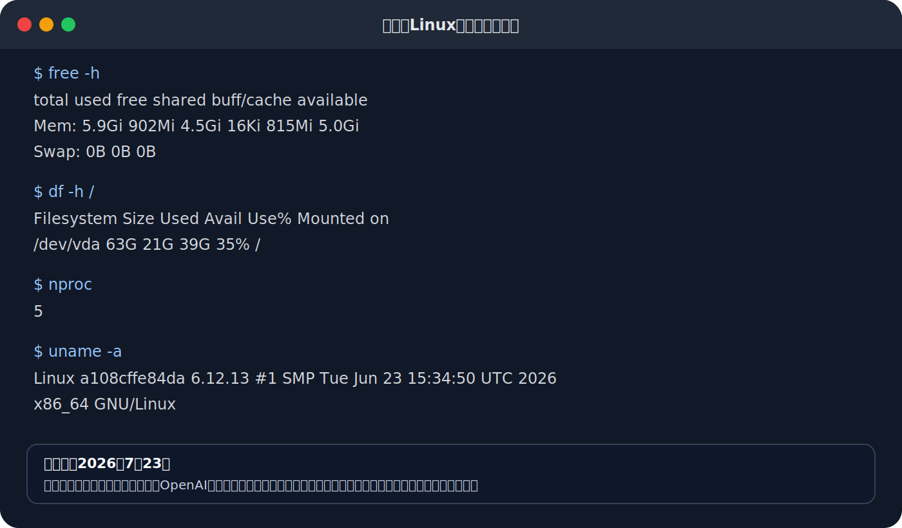

# ChatGPT Workとは何か？ 作業環境を実測し、長文校正を試してみた

ChatGPTに新しく追加された「Work」は、普通のチャットよりも長く複雑な作業を任せるためのモードです。

文章の校正、資料の調査、複数ファイルの比較、表やグラフの作成、レポートやスライドの作成などを、途中の工程も含めてまとめて依頼できます。

最初に結論を書くと、ChatGPT Workは「15GBメモリの仮想パソコン」という製品ではありません。

Web版とモバイル版のWorkはクラウド上の作業環境で動きますが、メモリやCPU、ディスク容量はOpenAIが固定仕様として公開しているものではありません。実行時にLinux環境が見える場合があっても、その値はセッションによって変わる可能性があります。

今回、この記事を修正した作業セッションで環境を確認したところ、メモリは5.9GiB、ルートディスクは63GB、論理CPU数は5と表示されました。

以前の原稿では「15GBの仮想パソコン」と書いていましたが、今回の実測結果とは異なります。したがって、15GBをWorkの公式仕様として紹介することはできません。

## ChatGPT Workとは何か

OpenAIは、ChatGPT Workを「長めの複数ステップの作業や、完成した成果物の作成に向けて設計されたエージェント」と説明しています。

普通のChatは、質問への回答、検索、相談、アイデア出しなど、短いやり取りに向いています。

Workは、最終的に何を完成させたいかを伝えると、必要な情報を集め、作業の進め方を考え、複数の工程を実行し、ファイルなどの成果物を作ります。

たとえば、次のような仕事をまとめて依頼できます。

- 複数の資料を読み、内容を比較する
- Webで最新情報を調査する
- 調査結果をレポートにまとめる
- Markdown、Word、PDFなどの文書を作る
- データを集計してスプレッドシートを作る
- グラフやダッシュボードを作る
- プレゼンテーションを作る
- WebサイトやWebアプリを作る
- 接続したGoogle Drive、Gmail、GitHubなどを利用する
- 指定日時や定期的な作業をScheduled Tasksとして実行する

作業中の進捗を確認し、途中で追加指示を出したり、方向を変えたり、重要な操作を承認したりすることもできます。

OpenAI公式の説明では、WorkはGPT-5.6を基盤とし、ファイル、接続したツール、デスクトップアプリなどから必要な情報を集め、完成した文書、表計算、スライドなどを作成することを目的としています。

## Chat、Work、Codexの違い

現在のChatGPTには、主にChat、Work、Codexという3つの使い分けがあります。

### Chat

Chatは、すぐに答えが欲しい質問や相談に向いています。

- 質問に答えてもらう
- 検索してもらう
- アイデアを出してもらう
- 短い文章を直してもらう
- 会話しながら考えを整理する

### Work

Workは、調査やファイル作成を含む複数工程の仕事に向いています。

- 資料を集める
- 複数ファイルを読む
- 情報を比較・分析する
- 作業手順を組み立てる
- 文書、表計算、スライド、レポート、Siteを完成させる
- 接続したサービスの情報を利用する
- 必要に応じて定期実行や監視を行う

### Codex

Codexはソフトウェア開発に特化しています。

- ソースコードを書く
- バグを修正する
- テストを実行する
- コマンドを実行する
- GitHubリポジトリを読む
- ファイルを修正する
- 変更内容をレビューする

文章の校正だけならChatでもできます。しかし、複数の原稿、表記ルール、参考資料を読み、Webで事実確認し、修正版と変更履歴をファイルとして作成するところまで任せるなら、Workの方が向いています。

「Workにしか絶対できない」というより、複数の道具を使う長い仕事を、一連の作業として進めるために設計されている点が大きな違いです。

## どの環境で使えるのか

2026年7月23日時点では、Web版とモバイル版のWorkは、Plus、Pro、Business、Enterprise、Eduなどの対象プランへ順次提供されています。

アカウントによっては、同じプランでもまだWorkが表示されない場合があります。段階的に提供されているためです。

デスクトップ版はmacOSとWindowsで利用できます。プランやワークスペースの設定によっては、許可を与えたローカルフォルダーやデスクトップアプリをWorkから利用できます。

Web版とモバイル版のWorkは、自分のパソコン内のファイルを勝手に読むことはできません。使わせたいファイルをアップロードするか、Google Driveなどの接続済みサービスから選ぶ必要があります。

クラウドで開始したWorkのチャットは、Web、モバイル、デスクトップ間で同期できます。一方、デスクトップ版でローカルチャットとして開始した作業は、そのパソコン内に残ります。

## Workは無料なのか

Web版とモバイル版のWorkは、基本的には対象となる有料プランに含まれています。

ただし、「月額料金を払えば何回でも無制限に使える」という意味ではありません。

Workの使用量は、Codexなどと共通のエージェント型使用量やクレジット枠から消費されます。消費量は、入力するファイルの量、作業の長さ、使用するモデル、処理の複雑さなどによって変わります。

PlusやProでは、プランに含まれる使用量を使い切ると、アカウントによっては追加クレジットを購入できる場合があります。追加購入を利用できない場合は、上限がリセットされるまで待つか、プランを変更する必要があります。

そのため、記事では「無料」や「追加料金なしで使い放題」とは書かず、次のように理解するのが正確です。

> Workは対象プランに含まれていますが、利用量には上限があります。上限や追加クレジットの利用可否は、プランとアカウントによって異なります。

## Workで何が作れるのか

Workでは、指示だけからファイルを作ることも、既存資料を読み込ませて編集することもできます。

### 文書

- 記事
- 報告書
- 議事録
- 提案書
- 手順書
- 調査レポート
- 校正済み原稿
- 変更履歴

### スプレッドシート

- 集計表
- 予算表
- スケジュール
- グラフ
- ダッシュボード
- 売上分析
- CSVの整理

### プレゼンテーション

- 会議資料
- 説明用スライド
- 営業資料
- 研修資料
- 調査結果の発表資料

### Sites

文章やデータから、共有できるWebサイトやWebアプリを作れます。

- ダッシュボード
- プロジェクト管理画面
- 開発中の試作品
- レポートサイト
- スケジュール管理
- 簡単な業務アプリ

### 接続したツールを使う作業

プラグインやアプリを接続すると、Google Drive、Gmail、GitHub、Notionなどの情報を読み書きできる場合があります。

利用できるサービスや操作は、プラン、地域、ワークスペース管理者の設定、接続したアプリの権限によって変わります。

Workに接続サービスを使わせる場合も、必要以上に広い権限を与えず、重要な更新や送信前には内容を確認した方が安全です。

## 既存ファイルやテンプレートも利用できる

Workには、見本となるファイルを渡して、同じ形式で新しい成果物を作らせることができます。

たとえば、過去の報告書を添付して次のように依頼できます。

```text
添付した昨年度の報告書と同じ章構成、見出し、文体を使用してください。
内容は今年度のデータに置き換えて、新しい報告書を作成してください。
表の列構成と用語は変更しないでください。
```

1回だけ見本として使うものは参照ファイルです。

繰り返し使う見本と指示を組み合わせたものはテンプレートとして利用できます。毎月の報告書、会議資料、定型の分析表などを同じ形式で作る場合に便利です。

Google Workspaceとの接続が有効なら、Googleドキュメント、スプレッドシート、スライドを直接作成または編集できる場合があります。

ただし、利用できるファイル形式や操作は、プラン、利用環境、ワークスペースの設定によって異なります。

## 本当に15GBの仮想パソコンなのか

Workの内部では、作業のためにLinux環境が使われることがあります。

しかし、OpenAIは「メモリ15GB、ディスク60GBの仮想パソコンを提供する」とは発表していません。

今回、この原稿を修正している作業セッションで、次のコマンドを実行して環境を確認しました。

```bash
free -h
df -h /
nproc
uname -a
```

結果は次のとおりでした。

- メモリ：5.9GiB
- 利用可能メモリ：5.0GiB
- ルートディスク：63GB
- ディスク空き容量：39GB
- 論理CPU数：5
- OS：Linux x86_64



この画像は、2026年7月23日にこの原稿を編集したセッションで実行したコマンド出力を、読みやすいようにSVG画像へ整形したものです。

OpenAIの公式仕様を示す画像ではありません。また、次回も同じ容量になるとは限りません。

ここから分かるのは、少なくとも「Workは必ず15GBメモリ」という固定仕様ではない、ということです。

また、`df -h`で表示されるディスク容量は、ChatGPTのLibraryとして永続保存できる容量とは別物です。

作業用Linux環境のディスクは、一時的な処理領域である可能性があります。一般的なVPSや、自分専用のクラウドパソコンのように、好きなソフトを入れて永久に維持できるものだと考えない方がよいでしょう。

## Libraryの保存容量とは別

ChatGPTにアップロードしたファイルや、ChatGPTが作成したファイルは、利用可能な場合はLibraryに保存されます。

2026年7月23日時点で、OpenAIが案内しているLibraryの保存容量は次のとおりです。

- Free：500MB
- Go：4GB
- Plus：20GB
- Business：20GB
- Pro：100GB

1ファイルあたりの主な上限もあります。

- 一般的なファイル：最大512MB
- テキストや文書：最大200万トークン
- CSVや表計算：おおむね最大50MB
- 画像：最大20MB

これらはLibraryやアップロードファイルの制限です。

作業環境で`df -h`を実行して表示されるディスク容量とは違います。「ディスクが63GBと表示されたので、63GB分のファイルを永久保存できる」という意味ではありません。

## 普通のChatではなく、Workで校正する意味

普通のChatでも、文章を貼り付けて「校正してください」と頼むことはできます。

しかし、実際の記事作成では、単に誤字を直すだけで終わらないことが多いでしょう。

たとえば今回の記事では、次の作業が必要でした。

1. GitHubリポジトリから下書きのMarkdownを読む
2. 記事内の主張を抜き出す
3. OpenAIの公式情報を検索する
4. 「15GB」「無料」「追加料金なし」などの表現を確認する
5. Chat、Work、Codexの違いを整理する
6. Workで作成できる成果物を調査する
7. 使用量、クレジット、Library容量を確認する
8. Linux環境でメモリとディスク容量を実測する
9. 実測結果から証拠画像を作る
10. 記事全体を書き直す
11. 修正版をGitHubリポジトリへ反映する

これは、短い質問に答えるというより、複数の道具を使って最終成果物を完成させる仕事です。

このような作業が、Workの得意分野です。

## Workを使った校正の実演

Workに複数ファイルを渡し、修正版と変更履歴を作らせる場合は、次のように依頼できます。

```text
添付した原稿を校正してください。

目的：
noteで公開する初心者向けの記事として、正確で読みやすい内容にすること。

使用する資料：
・記事原稿のMarkdown
・筆者の表記ルール
・参考資料

作業内容：
1. すべてのファイルを読む
2. 誤字脱字と不自然な表現を修正する
3. 同じ内容の繰り返しを減らす
4. 初心者に分かりにくい部分へ説明を追加する
5. 事実確認が必要な主張を抽出する
6. 公式情報を優先してWebで確認する
7. 確認できなかった内容は断定せず「未確認」と明記する
8. 元の見出し構成は、必要な場合だけ変更する
9. Markdown形式を維持する

成果物：
・校正済みのMarkdownファイル
・主な変更点をまとめたファイル
・事実確認が必要な箇所の一覧
・参照した公式資料の一覧

注意：
・筆者が実際に確認していない体験談を作らない
・推測を事実として書かない
・製品仕様と実測値を明確に区別する
```

この依頼のポイントは、「文章を直して」だけでなく、入力資料、作業工程、守るルール、必要な成果物を指定していることです。

Workは最終的な成果物を意識して動くため、修正版だけでなく、変更履歴や確認事項を別ファイルとして作らせる使い方ができます。

## 校正ツールを併用する場合

AIによる校正だけでなく、機械的なチェックも組み合わせられます。

たとえば、次のような確認です。

- 同じ語尾の連続
- 1文の長さ
- 全角と半角の混在
- 数字表記の揺れ
- 「できる」「出来る」などの表記揺れ
- 見出し階層の崩れ
- Markdownリンク切れ
- 禁止語や社内用語の混入

ただし、Web版Workで利用できるコマンドやソフトウェアは、公式に固定仕様として保証されているわけではありません。

「自由に好きなソフトをインストールできるパソコン」と説明するのではなく、必要な処理をWorkに依頼し、利用できる道具で実行してもらう、と考えた方が実態に近いでしょう。

## Workを上手に使う指示の書き方

Workへ依頼するときは、次の5点を書くと結果が安定します。

### 1. 最終目的

何のために作るのかを書きます。

```text
noteで公開する、AI初心者向けの記事を完成させてください。
```

### 2. 使用する資料

どのファイルやサービスを使うのか指定します。

```text
添付したMarkdownと、接続したGoogle Drive内の参考資料を使用してください。
```

### 3. 完成させる成果物

画面上の回答だけでよいのか、ファイルが必要なのかを指定します。

```text
修正版をMarkdownファイルで作り、変更履歴を別ファイルにしてください。
```

### 4. 変更してはいけないもの

文体、表の列、数式、見出し、ブランド表現などを指定します。

```text
一人称と筆者の口調は変えないでください。コードブロックの内容も変更しないでください。
```

### 5. 確認基準

何をもって完成とするかを書きます。

```text
公式情報と矛盾していないこと、リンクが有効であること、初心者が専門知識なしで読めることを確認してください。
```

## Workを使うときの注意点

### AIの回答をそのまま公開しない

Workは複数工程を自動で進められますが、間違いがなくなるわけではありません。

特に、料金、提供プラン、利用上限、法律、製品仕様などは変更されやすいため、公開前に公式情報を確認する必要があります。

### 実測値と公式仕様を区別する

今回の5.9GiBや63GBは、この作業セッションでの実測値です。

OpenAIが保証する製品仕様ではありません。実測値を掲載する場合は、測定日、実行したコマンド、環境によって変わる可能性を一緒に書くべきです。

### ローカルファイルの扱いに注意する

デスクトップ版Workにローカルフォルダーを開かせる場合は、作業に必要なフォルダーだけを許可した方が安全です。

社外秘、個人情報、パスワード、APIキーなどが含まれるファイルは、むやみに渡さないようにします。

### 接続アプリの権限を確認する

Gmail、Google Drive、GitHubなどを接続すると、Workが情報を取得したり、許可された操作を実行したりできます。

送信、削除、公開、更新などの重要な操作は、対象と内容を確認してから承認する必要があります。

### 作業環境が永久に残るとは限らない

チャットやLibraryに保存されたファイルは後から利用できます。

しかし、Linux環境へ入れたソフト、作業途中の一時ファイル、環境設定などが、次回も同じ状態で残るとは限りません。

残したい成果物は、Library、ローカルフォルダー、Google Drive、GitHubなどへ明示的に保存するべきです。

## Workの始め方

### Web版

1. ChatGPTを開く
2. 画面上部などから「Work」を選ぶ
3. 新しいWorkチャットを開始する
4. 必要なファイルを添付する
5. 完成させたい成果物を説明する
6. 作業の進捗を確認する
7. 必要なら途中で追加指示を出す
8. 完成したファイルを確認する

### プロジェクト内で使う

同じテーマのチャット、ファイル、指示をまとめたい場合は、ChatGPTのプロジェクトを利用します。

プロジェクト内でWorkを開始すると、そのプロジェクトに保存された資料や指示を使って作業できます。

長期的な記事執筆、定期レポート、調査資料の更新などに向いています。

### デスクトップ版

デスクトップ版では、ChatGPTを選んだ後、ChatとWorkを切り替えます。

プランと設定が対応していれば、ローカルフォルダーを開き、必要なファイルへのアクセスを許可できます。

Web版と違い、ローカルファイルを直接扱える点が大きな特徴です。ただし、ローカルで作成したファイルが自動的にWeb版のLibraryへ保存されるとは限りません。

## まとめ

ChatGPT Workは、15GBメモリの仮想パソコンを貸し出すサービスではありません。

調査、分析、ファイル操作、接続したツールの利用、成果物作成などを複数工程で進めるためのAIエージェントです。

今回の実測では、作業環境は次のように表示されました。

- メモリ：5.9GiB
- ルートディスク：63GB
- 論理CPU数：5

ただし、これは固定仕様ではなく、2026年7月23日の1セッションにおける参考値です。

文章校正でWorkを使う最大の利点は、誤字を直すことだけではありません。

原稿や参考資料を読み、公式情報を調べ、問題点を洗い出し、修正版、変更履歴、確認事項まで含めた完成物を作れる点にあります。

短い文章を直すだけならChatで十分です。

複数の資料と道具を使い、公開できる形まで仕上げたい場合は、Workを使う価値があります。

## 参考にしたOpenAI公式情報

- [ChatGPT ワークと Codex](https://help.openai.com/ja-jp/articles/20001275-chatgpt-work-and-codex)
- [ChatGPT Work 公式ページ](https://openai.com/ja-JP/chatgpt-work/)
- [ChatGPT ワークでのドキュメント、スプレッドシート、プレゼンテーションの作成と編集](https://help.openai.com/ja-jp/articles/20001278-creating-and-editing-documents-spreadsheets-and-presentations-with-chatgpt-work)
- [ChatGPT のファイル保存と Library](https://help.openai.com/ja-jp/articles/20001052-file-storage-and-library-in-chatgpt)
- [ChatGPT と Codex のプラグイン](https://help.openai.com/ja-jp/articles/20001256-plugins-in-codex)
- [ChatGPT プランで Codex を使う](https://help.openai.com/ja-jp/articles/11369540-using-codex-with-your-chatgpt-plan)

※機能、対応プラン、利用上限、保存容量は変更される可能性があります。この記事の記載内容は2026年7月23日時点で確認したものです。
